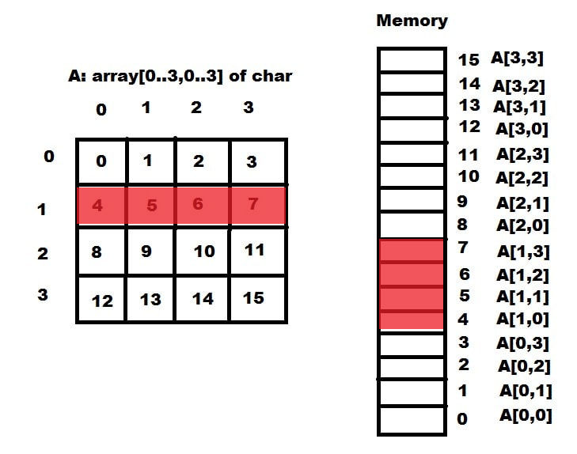
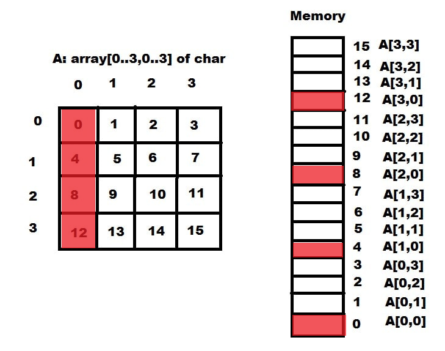
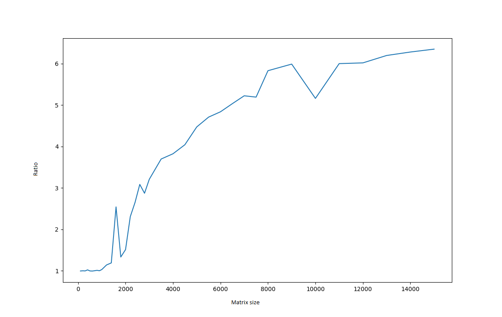

# CPU stalls problem
The CPU does not get directly the data from main memory. To speed up, executable code and data is loaded into caches before being consumed. It helps to reduce the average cost to access data from external RAM. However, this architecture leads to cache miss problems.

<p align="center">
  
</p>

The cache memory is much smaller than RAM, so it cannot contain a large data segment. If instruction code requires a missed value from caches, the CPU will run out of things to do while waiting to fetch one cache line from the main memory. When a CPU reaches this state, it is called a stall. Therefore, the developer should optimize the code to reduce data fragmentation.

This example shows the effect of memory access on program speed. A row major order square matrix is processed in different ways. The first way tries to handle data in a row in which cell values are placed next to each other in memory. The other way handles data by column which cell addresses are discontinuous.

<p align="center">
<table>
<tr>
<td>

<p align="center">Row segment</p>
</td>
<td>

<p align="center">Column segment</p>
</td>
</tr>
</table>
</p>

Following functions compute the sum of all elements in a square matrix. Both of them have the same complexity. The difference here is how they traverse the data. The function ```row_major_process``` considers row as a segment data to be scanned while the rest scans column by column. Because the input value is a square matrix, both row segment and column segment have the same length. To highlight the problem, functions access the segment's element randomly via a shuffered indexes list  ```c->index```.

<table>
<thead>
<tr>
<th> ROW MAJOR </th>
<th> COLUMN MAJOR </th>
</tr>
</thead>
<tr>
<td>

```c++
double row_major_process(square* c) {
	double s = 0;
	for (int y = 0; y < c->n; y++) {
		for (int x = 0; x < c->n; x++) {
			s += c->data[y * c->n + c->index[x]];
		}
	}
	return s;
}
```

</td>
<td>

```c++
double column_major_process(square* c) {
	double s = 0;
	for (int x = 0; x < c->n; x++) {
		for (int y = 0; y < c->n; y++) {
			s += c->data[c->index[y] * c->n + x];
		}
	}
	return s;
}
```

</td>
</tr>
</table>

Compiling the project Visual C++ 2019 [*TestMemAccess*](TestMemAccess) in release x64 mode generates file [*x64/Release/TestMemAccess.exe*](x64/Release/TestMemAccess.exe). This program measures and prints out the ratio between running time of function ```column_major_process``` and ```row_major_process```. Then, the script [*evaluate.py*](evaluate.py) calls the program to evaluate the dependence of ratio value on the size of the matrix.

The testing environment is CPU AMD Ryzen 5 5600H (L1: 384KB, L2: 3MB, L3: 16MB) on Windows 11. The result is shown as following figure:

<p align="center">

</p>

When the matrix size is smaller than 1000x1000 (~8MB), the ratio values are close to 1. This is because the small data can be fetched into L3 fully, then the CPU can access values without waiting to look up the main memory. The ratio increases up to about 6 when the matrix size is 8000x8000.

From the above chart, we see that optimizing the code to reduce the cache miss problem can speed up the program up to 6 times.
